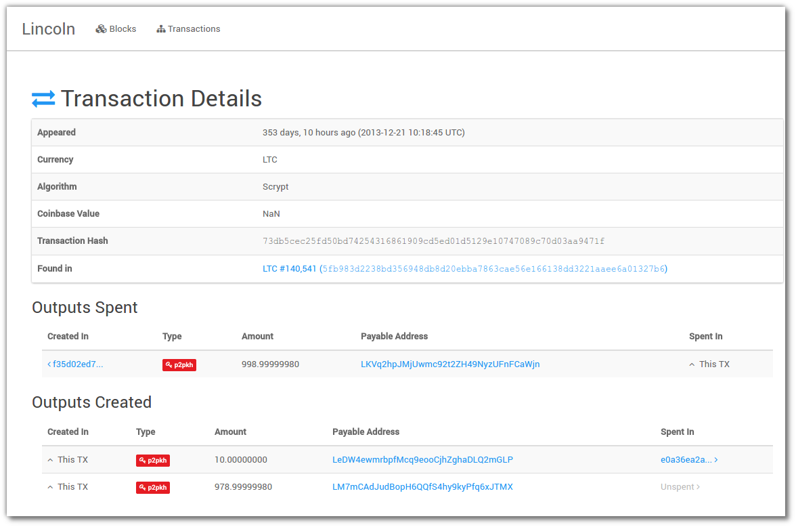

# BCHBrowser
A web browser for BCH

Lincoln
==========

A lightweight block explorer for BCH. Meant to be an improvement over Abe (hence the
name). Design goals:

* Straightforward to setup with minimal dependencies
* Reasonable space consumption
* Clean, well written codebase for hackabilitiy.

**Lincoln is still very much under development, so keep in mind that things may
be a bit bumpy. Several key features are still missing!**

### [Demo](http://ltctest.ibcook.com)


Stack
-----

* Python 3.2+
* Flask
* SQLAlchemy
* python-bitcoinlib
* Redis
* Gunicorn (although an WSGI server will work)

Missing Key Features
--------------------

* Block reorgs aren't handled properly. A complete reindex is required.
* Sync status isn't shown, so the site may look oddly out of date if connection
  is lost or doing initial sync.
* There are no API endpoints, just a UI
* The address overview page is lacking a lot of information.

Setup
-----

``` bash
# Python 3.4 is highly preferred due to decimal support
mkvirtualenv lincoln --python /usr/bin/python3.4
pip install -r requirements.txt
pip install -e .
```

Now copy `example.yml` to `config.yml` and enter your RPC information.

``` bash
# Initialize the database
python manage.py init_db
# To run the webserver
python manage.py runserver
# To sync the blockchain
python manage.py sync
```

Production
----------

To setup Lincoln on an Ubuntu box, follow these recommendations:

The chain sync chrontab should look something like this:

```
*/1 * * * * /usr/bin/flock -n /tmp/litecoin_scan.lockfile /path/to/my/virtualenv/bin/python /path/to/repo/manage.py sync >> /home/block/sync.log
```

An upstart config for the webserver would look something like this:

```
start on (filesystem)
stop on runlevel [016]

respawn
console log
setuid block
setgid block
chdir /home/block/lincoln

exec /home/block/lincoln_venv/bin/gunicorn lincoln.wsgi_entry:app -b 127.0.0.1:11000 --timeout 270
```
